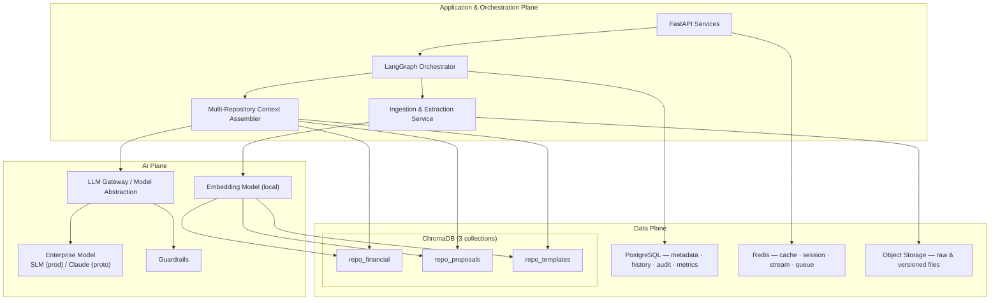
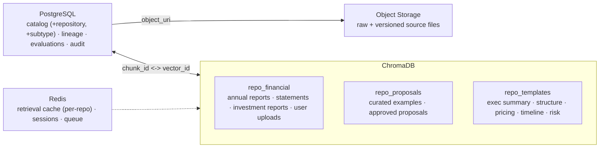
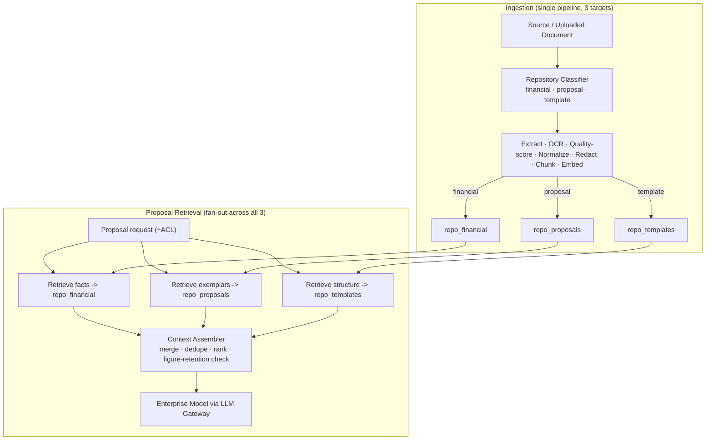
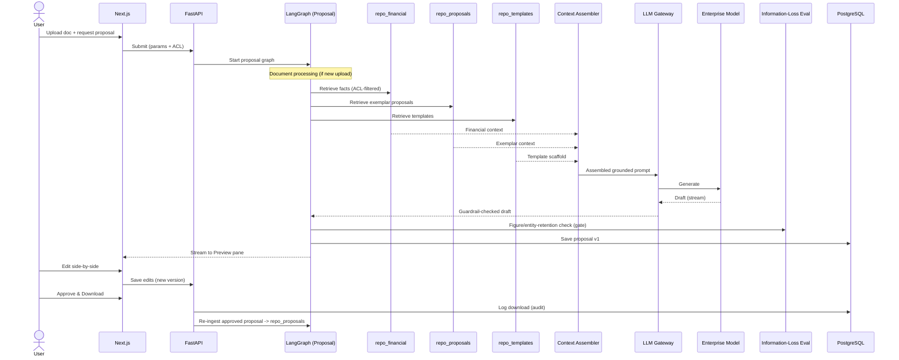
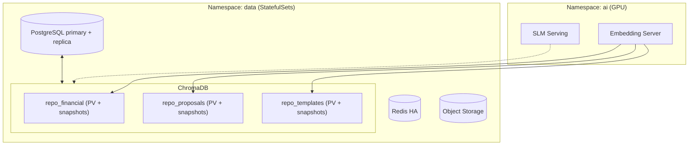
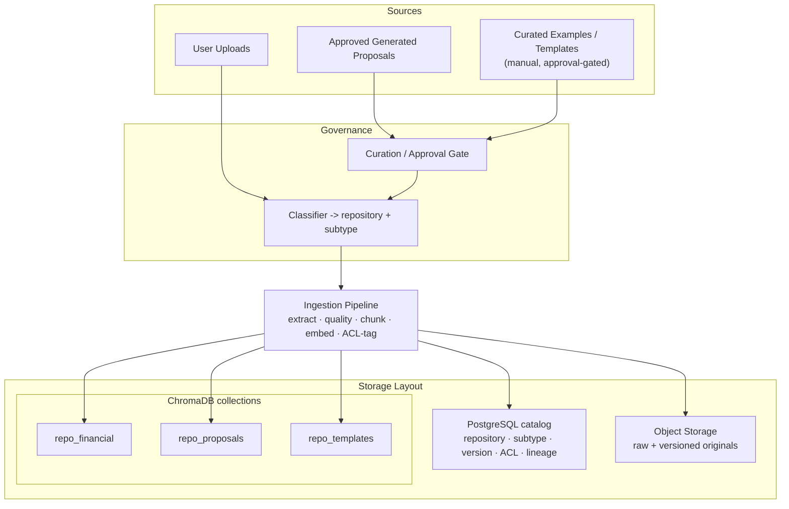

# Architecture Update — Multi-Repository Knowledge & Proposal Flow

**Revision:** R2 · **Scope:** Delta to the base architecture. Only changed sections are reproduced below.
**Summary of change:** Three governed knowledge repositories are introduced, all ingested into ChromaDB as separate collections through the existing ingestion pipeline. Proposal generation now retrieves from **all three** repositories before the enterprise model is invoked.

---

## 0. New Concept — Three Knowledge Repositories

All three are ingested via the **same ingestion pipeline** (extract → quality-score → normalize/redact → chunk → embed → ACL-tag) and stored as **separate ChromaDB collections**, with metadata cataloged in PostgreSQL and raw files in object storage. They contribute different things to a proposal:

| Repository | ChromaDB collection | Contents | Role in proposal |
|---|---|---|---|
| **Financial Documents** | `repo_financial` | Annual Reports, Financial Statements, Investment Reports, Uploaded User Documents | **The facts** — substantive grounding content. |
| **Proposal Knowledge** | `repo_proposals` | 20–30 curated examples (banking consulting, investment, risk assessment) + previously generated **approved** proposals | **The exemplars** — style, framing, domain language (few-shot). |
| **Template** | `repo_templates` | Executive Summary, Proposal Structure, Pricing, Timeline, Risk Assessment templates | **The scaffold** — required structure and sections. |

Separation of concerns: *facts* (financial) + *how good proposals read* (proposal KB) + *required shape* (templates). Approved generated proposals are re-ingested into `repo_proposals`, forming a curation feedback loop.

---

## 1. High-Level Architecture *(updated — Data Plane + proposal retrieval fan-out)*

The new element is the **Multi-Repository Context Assembler**: for proposal generation it queries all three collections (ACL-filtered) and merges results into a single grounded prompt before the model is called.

---

## 2. Data Plane *(updated)*

ChromaDB now hosts **three logical collections** rather than one. Each is independently namespaced, ACL-tagged, versioned, and backed up. PostgreSQL gains a `repository` dimension on the document catalog so every chunk is attributable to its source repository.

---

## 3. Private RAG Architecture *(updated)*

**Ingestion** is unchanged in shape but now routes each document to one of three target collections based on its repository classification. **Retrieval** gains a proposal-specific fan-out: chat/Q&A still queries `repo_financial`, but proposal generation queries all three collections and assembles a blended context.

Retrieval order is **Financial → Proposal → Template → Assembly** as specified; within the LangGraph node the three queries may execute concurrently while the assembler preserves that precedence when composing the prompt (facts first, then exemplar framing, then template scaffold).

---

## 4. Data Flow Diagrams *(updated — proposal generation)*

### 4.1 New end-to-end proposal flow

```mermaid
flowchart LR
    A["Document Upload"] --> B["Document Processing<br/>extract · OCR · quality · chunk · embed"]
    B --> C["Financial Repository Retrieval"]
    C --> D["Proposal Repository Retrieval"]
    D --> E["Template Repository Retrieval"]
    E --> F["Context Assembly"]
    F --> G["Enterprise Model"]
    G --> H["Proposal Generation"]
    H --> I["Proposal Preview"]
    I --> J["User Editing (side-by-side)"]
    J --> K["Download"]
    K -.->|"if approved"| L["Re-ingest into repo_proposals"]
    L -.-> D
```

### 4.2 Proposal generation sequence *(replaces base §5.3)*

---

## 5. Deployment Architecture *(updated — Data namespace)*

The only deployment change is within the data namespace: the ChromaDB StatefulSet now serves three collections on persistent volumes, each independently snapshotted and restorable. No new services or egress paths are introduced.

---

## 6. Repository Storage Architecture *(new)*

Each repository spans three stores with a shared governance model. ChromaDB holds the vectors per collection; PostgreSQL is the catalog/lineage system of record (now keyed by `repository` and `subtype`); object storage holds raw files. The Proposal Knowledge and Template repositories add a **curation/approval gate** before ingestion — they are manually curated, not open-upload.

**Storage & governance notes**
- **Collection isolation:** one ChromaDB collection per repository; cross-repository leakage is impossible at query time because retrieval targets named collections under the caller's ACL.
- **Catalog keys:** PostgreSQL `documents` gains `repository` (financial · proposal · template) and `subtype` (e.g., annual_report, risk_assessment, pricing_template) so lineage and metrics can be sliced per repository.
- **Curation gate:** `repo_proposals` and `repo_templates` accept content only via approval; user uploads flow only into `repo_financial`.
- **Feedback loop:** approved generated proposals are re-ingested into `repo_proposals`, continuously enriching exemplars while preserving immutable audit lineage.
- **Backup/retention:** each collection is snapshotted independently; templates and curated proposals follow a slower, versioned change cadence than the higher-churn financial corpus.

---

*All other base-document sections (Layered Architecture, Security Architecture, Database ER model, LangGraph appendix) are unchanged except for the additive `repository`/`subtype` catalog columns noted above.*
