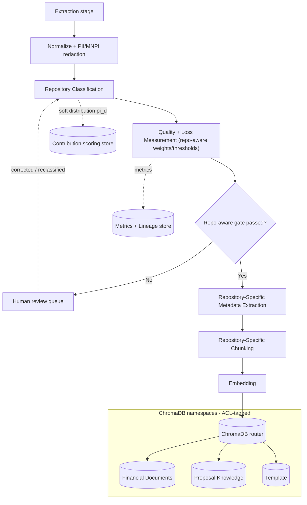
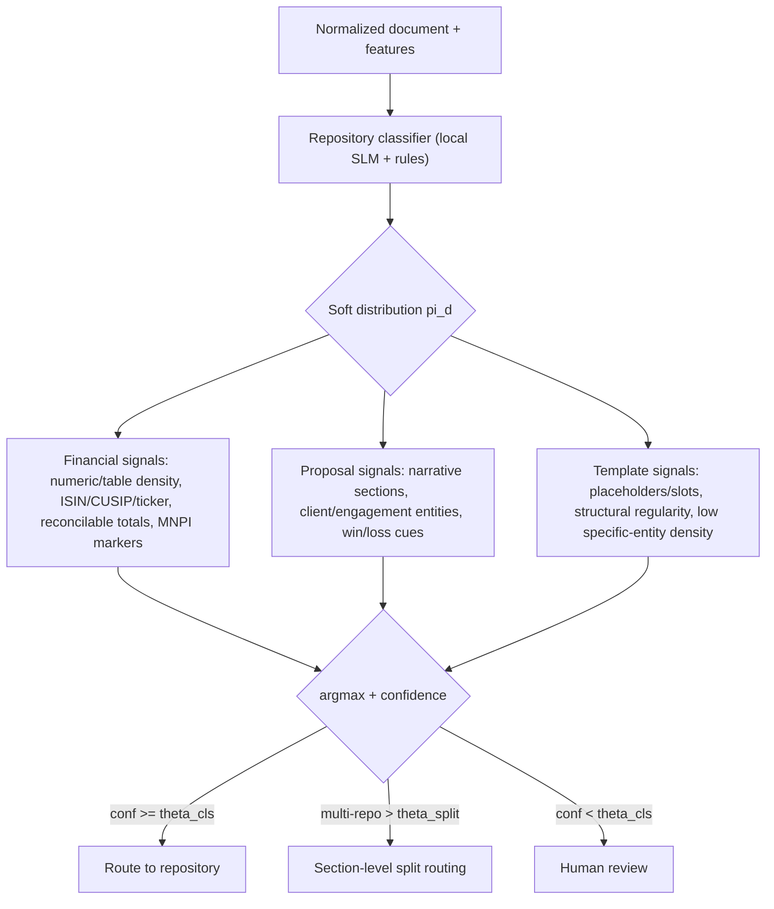
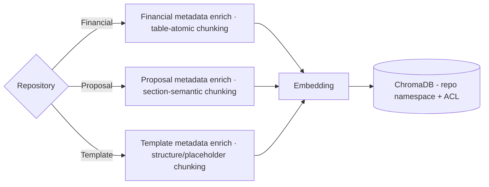
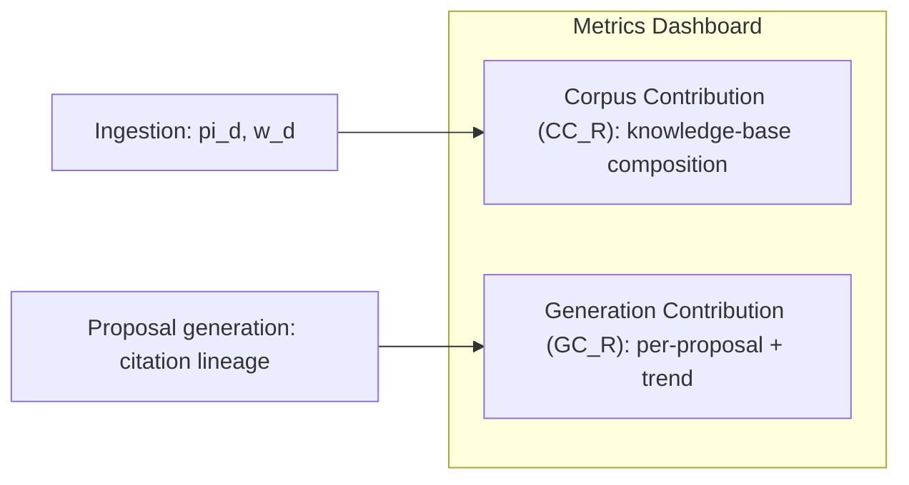

# Document Intelligence Architecture — Repository Routing Update

*Addendum to `document-intelligence-platform-architecture.md`. Only sections requiring changes are included.*
*This update inserts repository classification and repository-specific handling between extraction and indexing.*

**Sections amended:**
- §2 High-Level Architecture → pipeline tail extended (see U-1)
- §5.5 Metadata Extraction → superseded by the layered metadata model (see U-2)
- New stages added to the extraction workflow (see U-3)
- §8 Loss Framework gate → made repository-aware (see U-4)
- New subsystem: Repository Contribution Scoring (see U-5)

The pipeline model changes from the prior four arrows to:

> **D** → **X** (extract) → **N** (normalize + redact) → **classify repo** → **gate (repo-aware)** → **R-meta** (repo-specific metadata) → **K_R** (repo-specific chunks) → **V_R** (per-repo namespaced index)

---

## U-1. Updated Ingestion Architecture

Repository classification now sits immediately after normalization, so the quality gate can apply **repository-specific weights and thresholds**, and the document then flows through repository-specific metadata and chunking into a namespaced ChromaDB collection.

### Repository Classifier

A local classifier (small NER/text model + deterministic rules — no external APIs) emits a **soft distribution** `π_d = (π_FIN, π_PROP, π_TMPL)` with `Σ = 1`, plus a confidence. Routing is `argmax(π_d)` above the classification threshold; a document spanning multiple repositories above a split threshold is routed at **section level**.

Classification confidence is itself a quality signal and a soft gate (U-4); the distribution `π_d` feeds contribution scoring (U-5). Repository label, `π_d`, and confidence are written to lineage.

---

## U-2. Updated Metadata Model

Metadata is now **layered**: a common base applied to every document, plus a repository-specific schema. This supersedes the flat §5.5 fields.

### Base metadata (all repositories)

| Field | Description |
|---|---|
| `doc_id`, `source_uri`, `file_type` | Identity and origin |
| `ingestion_ts`, `page_count`, `language` | Provenance basics |
| `acl_tags` | RBAC/ABAC + document-level ACLs (carried into retrieval) |
| `sensitivity` | PII / MNPI flags + redaction ledger reference |
| `quality` | `EQS_doc`, `IPS`, `CFR`, loss vector (from §8) |
| `repository`, `repo_confidence`, `pi_d` | Classification result + soft distribution |
| `lineage_root` | Pointer into immutable audit log |

### Repository-specific schemas

| Financial Documents | Proposal Knowledge | Template |
|---|---|---|
| `doc_subtype` (statement, filing, term sheet, research, prospectus) | `proposal_subtype` (past proposal, case study, SOW, pitch, methodology) | `template_type` (proposal, section, boilerplate, slide master) |
| `issuer` / `counterparty` entities | `client`, `industry`, `sector` | `placeholder_slots` (e.g. `{client_name}`, `{fee}`) |
| `instrument_types` (equity, bond, derivative, fund) | `engagement_type` (advisory, M&A, strategy, audit) | `section_taxonomy` (ordered skeleton) |
| `identifiers` (ISIN/CUSIP/ticker) | `outcome` (won/lost/pending) | `applicable_engagements` |
| `fiscal_period`, `as_of_date`, `reporting_standard` (GAAP/IFRS) | `sections_present` (exec summary, approach, team, pricing, timeline) | `version`, `status` (draft/approved/deprecated) |
| `currency` | `recency` / `proposal_date` | `last_reviewed`, `brand_compliance` |
| `critical_figures_index` (figures + criticality weights) | `reusable_blocks` (narrative units) | `parameter_count`, `well_formed_slots` |
| `table_inventory` + `reconciliation_status` | `author`, `practice_area` | `structural_elements` count |
| `mnpi_classification` | — | — |

Repository-specific fields become **ChromaDB metadata** for filtered retrieval (e.g., "only `outcome=won` proposals in the client's `industry`," or "only `status=approved` templates").

---

## U-3. Updated Extraction Workflow

Base extraction (§5, the six tasks) is unchanged. Two new repository-aware stages follow the gate, then route into namespaces.

### Repository-specific chunking

- **Financial Documents** — *structure-preserving, integrity-first.* Tables are **atomic chunks** (never split across boundaries) carrying their reconciliation context and fiscal-period header; figure+caption kept together; smaller chunks around dense numeric regions; each chunk tagged with `as_of_date` and source bbox so a retrieved figure always knows its period.
- **Proposal Knowledge** — *section-semantic.* Chunked along proposal sections (exec summary, approach, pricing…), larger narrative windows that preserve argument flow, each chunk tagged with `section_type` so retrieval can target the right part of a proposal and `outcome` so won proposals can be weighted up.
- **Template** — *structure/placeholder-aware.* A chunk is a **reusable unit** (a section skeleton with its slots), boilerplate kept intact, placeholder markers preserved verbatim so templates remain parameterizable after retrieval.

Each stream is embedded and written to its **ChromaDB namespace** (one collection per repository), ACL-tagged, with the repository-specific metadata attached for filtering.

---

## U-4. Repository-Specific Quality Metrics

The single gate (§8.7) becomes **three repository-aware gates**: different modality weights in `EQS`, different predicates, and a few repository-specific metrics. Notation follows §8 (`S_m = 1 − L_m`, `EQS = Σ w_m·S_m`).

### Modality weight vectors

| Modality | Financial `w_m` | Proposal `w_m` | Template `w_m` |
|---|---|---|---|
| text | 0.20 | 0.40 | 0.15 |
| ocr | 0.10 | 0.05 | 0.05 |
| table | **0.30** | 0.10 | 0.05 |
| figure | 0.05 | 0.05 | — |
| meta | 0.05 | 0.10 | 0.10 |
| entity | **0.30** | 0.10 | — |
| semantic retention | — | **0.20** | — |
| structure / placeholder | — | — | **0.65** |

### New repository-specific metrics

- **Section Coverage** (Proposal): **SC = sections_detected / sections_expected(subtype)** — are the expected proposal sections present.
- **Placeholder Integrity** (Template): **PI = placeholders_wellformed / placeholders_total** — every slot detected and syntactically valid.
- **Structural Fidelity** (Template): **SF = structural_elements_preserved / structural_elements_source**.
- **Classification Confidence** (all): **conf = max(π_d)** — used as a soft gate.

### Repository gate predicates

| Repository | Approve iff |
|---|---|
| **Financial Documents** | `CFR ≥ 0.98` **and** `RPR ≥ 0.99` **and** `EQS_fin ≥ 0.90` **and** no critical low-confidence region |
| **Proposal Knowledge** | `EQS_prop ≥ 0.85` **and** `SC ≥ 0.90` **and** `conf ≥ θ_cls` |
| **Template** | `PI ≥ 0.99` **and** `SF ≥ 0.95` **and** `EQS_tmpl ≥ 0.90` |

Financial documents keep the strictest bar (numeric integrity and critical-figure retention are hard gates). Proposals optimize for narrative completeness; templates for structural and placeholder integrity, where text content matters least. Any gate failure routes to re-extraction or human review exactly as in §8.7, now annotated with the repository.

---

## U-5. Repository Contribution Scoring

Three percentages — **Financial Document Contribution %**, **Proposal Repository Contribution %**, **Template Repository Contribution %** — defined at two granularities, both surfaced on the Metrics Dashboard. Within each granularity the three sum to 100%.

### (a) Corpus Contribution — composition of the indexed knowledge base

Using the per-document soft distribution `π_d` and content weight `w_d` (indexed chunk or token count):

> **CC_R = ( Σ_d w_d · π_d^R ) / ( Σ_d w_d )**   for R ∈ {FIN, PROP, TMPL}, with **Σ_R CC_R = 1**.

For hard-routed documents this reduces to **CC_R = ( Σ_{d∈R} w_d ) / ( Σ_d w_d )**. This answers *"what share of the knowledge base lives in each repository."*

### (b) Generation Contribution — how a proposal is actually built (lineage-based)

For a generated proposal *P*, each grounded output sentence *u* (length `ℓ_u`) traces via citations to source chunks; let `g_u^R` be the share of *u*'s grounding drawn from repository R (`Σ_R g_u^R = 1`):

> **GC_R(P) = ( Σ_u ℓ_u · g_u^R ) / ( Σ_u ℓ_u )**, with **Σ_R GC_R(P) = 1**.

Aggregated across a period for dashboard trends:

> **GC_R = ( Σ_P Σ_u ℓ_u · g_u^R ) / ( Σ_P Σ_u ℓ_u )**.

This answers *"how much each repository contributed to the proposals we produced"* — e.g., a typical proposal grounded 55% in financial documents, 35% in past proposals, 10% in templates. Because it is built from citation lineage, every percentage is auditable back to source chunks and pages.

---

## Integration Notes

- Repository classification reuses already-extracted features (entity density, table presence, structure) — no extra extraction pass.
- The redaction-vs-loss separation (§8.6) and full lineage (§9) are unchanged and now also record `repository`, `π_d`, and `repo_confidence`.
- ChromaDB moves from one collection to **three ACL-tagged namespaces**; retrieval already filters by ACL, now additionally by repository and repository-specific metadata.
- Open consideration: section-level split routing means one source document can contribute to multiple namespaces — contribution scoring (U-5) already handles this via the soft distribution `π_d`.
