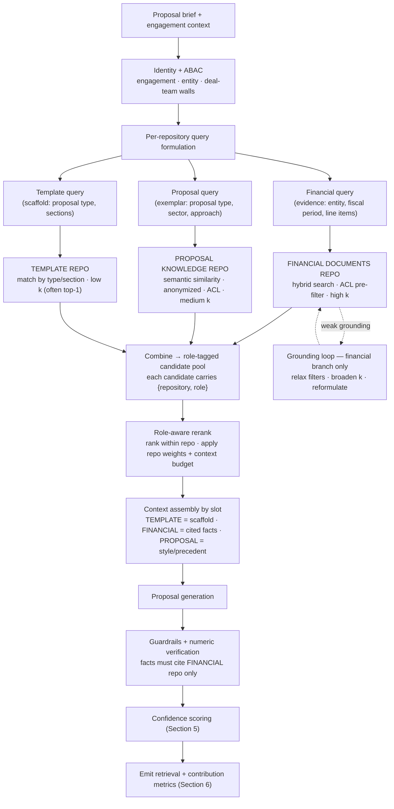
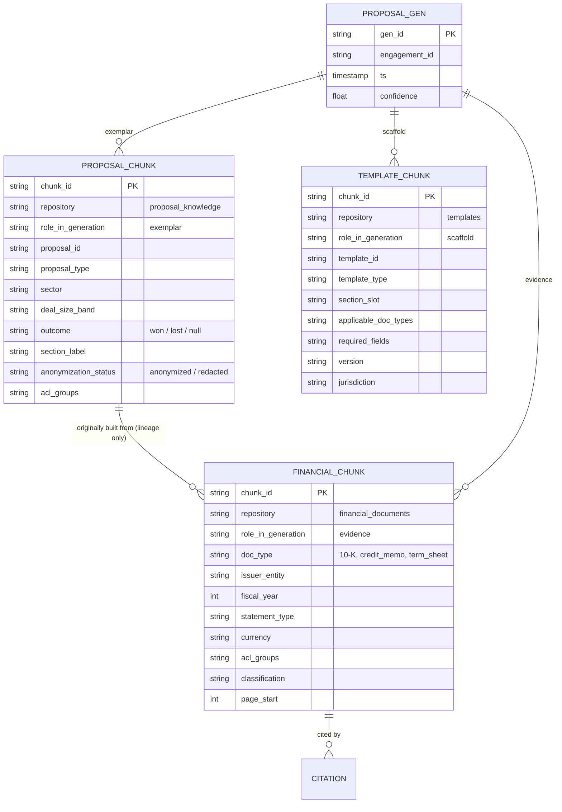
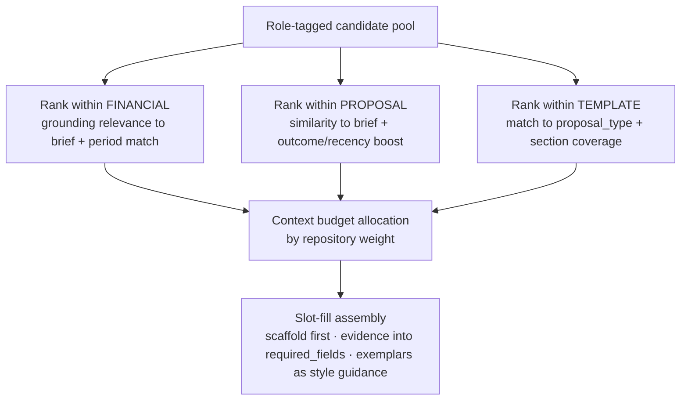
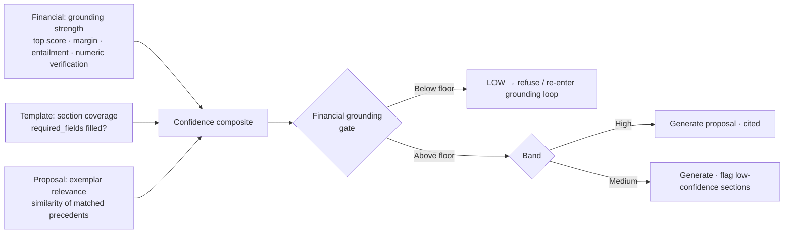
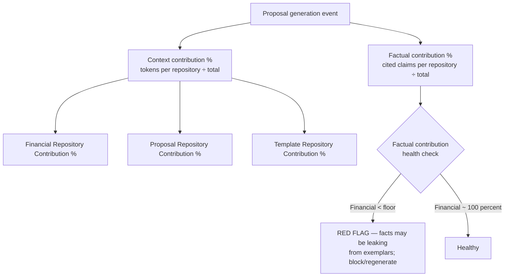

# Private RAG — Multi-Repository Update (Proposal Generation)

*Addendum to `private-rag-design.md`. Introduces three repositories and a federated, role-aware retrieval workflow for proposal generation. Only the sections that change are reproduced here. Air-gapped, internal-only, no code.*

---

## Governing Change: Repositories Have Roles, Not Just Contents

The system now retrieves from **three repositories**, and the central design rule is that each plays a **distinct role** in the generated proposal. They are never merged into one global ranking, because doing so would let style or structure outrank evidence — or, worse, let figures from a past client's proposal become "facts" in a new one.

| Repository | Role in generation | What it may contribute | What it may **not** contribute |
|---|---|---|---|
| **Financial Documents** | **Evidence** | Cited facts and figures for the current engagement | — |
| **Proposal Knowledge** | **Exemplar** | Structure, narrative approach, framing, language | Factual figures — these would risk cross-engagement MNPI leakage |
| **Template** | **Scaffold** | Section skeleton, required slots, boilerplate, formatting | Facts or client-specific content |

> **Hard rule (finance-critical):** every cited fact in a proposal must resolve to the **Financial Documents Repository**, scoped to the current engagement. Proposal examples are anonymized/redacted and used only for *how to say it*, never *what the numbers are*. This is enforced at context assembly and again at numeric verification.

---

## 1. Updated Retrieval Architecture (Federated, Role-Aware)

Retrieval fans out into three branches, each with its own query formulation, filters, candidate budget, and scoring profile. Results are combined into a **role-tagged candidate pool**, reranked within their roles, assembled by slot, then generated. The grounding loop now applies **specifically to the financial branch**, because that branch carries the factual burden.

**Branch profiles**

- **Financial branch** — hybrid dense+sparse search, ACL pre-filtered and scoped to the current engagement/entity/period; high recall (high *k*); subject to the grounding loop and numeric verification. This is the only branch whose chunks become citations.
- **Proposal branch** — semantic similarity between the *brief* and past proposals; ACL-filtered and restricted to **anonymized** content; returns a small set of structurally relevant exemplars used for approach and language.
- **Template branch** — near-deterministic match by proposal type and required sections; typically returns one primary scaffold (plus alternates); low *k*.

The LangGraph workflow becomes a **fan-out / fan-in**: three parallel retriever nodes, a combine node, then the existing linear rerank → assemble → generate path. Workflow state now carries per-branch candidate sets and scores so contribution can be measured downstream.

---

## 2. Updated ChromaDB Schema (Three Collections)

Each repository is a separate, namespaced, ACL-tagged collection. Every chunk gains a **`repository` discriminator** and a **`role_in_generation`** tag. PostgreSQL remains the lineage and ACL source of truth and now also records cross-repository links (which financial docs an exemplar proposal was originally built from).

Collection names: `financial_documents`, `proposal_knowledge`, `templates`. The `PROPOSAL_GEN` record links a generation event to the exact chunks it drew from each repository — this is what makes the contribution metrics in Section 6 auditable.

---

## 3. Updated Metadata Schema

A **common base** carries across all three repositories; each repository adds role-specific fields. Two new fields are mandatory everywhere.

**New common fields (all chunks)**

| Field | Purpose |
|---|---|
| `repository` | Discriminator: `financial_documents` / `proposal_knowledge` / `templates`. |
| `role_in_generation` | `evidence` / `exemplar` / `scaffold`. Drives assembly, ranking, and the citation/leakage rules. |

**Financial Documents (evidence)** — unchanged from the base design: `doc_type`, `issuer_entity`, `counterparty`, `fiscal_year`, `fiscal_quarter`, `as_of_date`, `currency`, `units`, `statement_type`, `has_financials`, page/section anchors, `classification`, `acl_groups`, `extraction_quality_score`, `ocr_confidence`.

**Proposal Knowledge (exemplar)**

| Field | Purpose |
|---|---|
| `proposal_id`, `section_label` | Identity and which section of a past proposal the chunk is. |
| `proposal_type`, `sector`, `deal_size_band` | Similarity scoping to the current brief. |
| `outcome` | Optional won/lost signal — can boost ranking toward successful precedents. |
| `anonymization_status` | Gate: only anonymized/redacted chunks are retrievable. |
| `source_doc_refs` | Lineage to the financial docs it was originally built from (audit only — never reused as facts). |

**Templates (scaffold)**

| Field | Purpose |
|---|---|
| `template_id`, `template_type`, `version` | Identity and versioning of the scaffold. |
| `section_slot` | The proposal section this fragment fills (executive summary, scope, fees, terms…). |
| `applicable_doc_types`, `jurisdiction` | Selection constraints. |
| `required_fields` | Slots the generator must fill from evidence — drives the information-loss gate. |

---

## 4. Updated Ranking Strategy (Within-Repository, Then Weighted Budget)

Ranking is **two-stage and never globally pooled by raw score**. First, candidates are ranked **within their repository against a repository-specific relevance criterion**. Then a **context budget** is allocated across repositories by configurable weights, so each role gets a guaranteed share of the assembled context.

**Within-repository criteria**

- **Financial** — fused dense+sparse + cross-encoder relevance to the brief, with a hard period/entity match (wrong-period evidence is dropped, not down-weighted).
- **Proposal** — similarity of the *brief* to the exemplar, boosted by `outcome = won` and recency, scoped by `proposal_type`/`sector`.
- **Template** — deterministic match on `proposal_type` and best section coverage; usually a single primary template wins.

**Cross-repository combination** is by **weight and budget, not score comparison.** A default profile weights evidence highest (it carries the facts), reserves a fixed scaffold slot for the template, and gives exemplars a bounded share so they inform style without crowding out evidence. Weights are configurable per proposal type and are recorded with the generation event for auditability.

> Pooling all three into one similarity ranking is explicitly rejected: a highly similar past proposal could otherwise outrank the financial evidence the new proposal must actually be built on.

---

## 5. Updated Confidence Scoring (Per-Repository Signals)

Confidence is now a composite of **per-repository coverage signals**, gated by the financial branch. The principle: **a beautiful template and great exemplars cannot rescue weak factual grounding.** If the financial evidence is thin or unverified, confidence is low regardless of the other two repositories.

| Input | Source | Weight role |
|---|---|---|
| Grounding strength | Financial repo | **Dominant + gating.** Top retrieval score, score margin, claim entailment coverage, numeric verification pass-rate. |
| Section coverage | Template repo | Are all `required_fields` of the chosen template fillable from evidence? Unfillable required slots → lower confidence + information-loss flag. |
| Exemplar relevance | Proposal repo | Minor. Raises confidence in *framing*, never in *facts*. |

The **financial grounding gate** is a floor: if evidence grounding is below threshold, the system refuses or re-enters the grounding loop on the financial branch — even when template and exemplar signals are strong. This preserves the original platform principle (refuse rather than answer outside the corpus) under the new multi-repository flow.

---

## 6. Retrieval & Repository Contribution Metrics

Two metric families are added, both emitted per generation and surfaced on the metrics dashboard.

### 6a. Retrieval Metrics (per generation)

| Metric | Definition |
|---|---|
| **Retrieved Financial Documents** | Count of financial chunks/docs that passed filtering and entered the candidate pool, with score distribution. |
| **Retrieved Proposal Examples** | Count of anonymized proposal chunks retrieved as exemplars, with similarity scores. |
| **Retrieved Templates** | Count of template fragments retrieved and which primary scaffold was selected. |

### 6b. Repository Contribution Metrics (per generation)

Contribution is measured two ways, because "how much a repository shaped the output" differs from "how much factual weight it carried." Both are reported per repository.

- **Context contribution %** = assembled-context tokens (or chunks) from repository *R* ÷ total assembled-context tokens. Captures how much each repository shaped the input to generation.
- **Factual contribution %** = grounded claims cited to repository *R* ÷ total grounded claims. By the hard rule, this should be ~100% Financial and ~0% for the others.

| Reported metric | Healthy expectation | Why it matters |
|---|---|---|
| **Financial Repository Contribution %** | High factual share (≈100% of citations); substantial context share | Confirms the proposal is built on engagement evidence. |
| **Proposal Repository Contribution %** | Moderate context share, ~0% factual | Confirms exemplars influenced style, not numbers. |
| **Template Repository Contribution %** | Steady structural context share, 0% factual | Confirms the scaffold shaped structure only. |

The **factual contribution health check is a guardrail**, not just a dashboard tile: if any non-financial repository contributes factual citations, or financial factual contribution falls below its floor, the generation is blocked and regenerated — that pattern is the signature of cross-engagement figure leakage.

---

## Summary of What Changed

| Section | Change |
|---|---|
| Retrieval architecture | Single path → **federated fan-out across three repositories**, role-tagged combine, grounding loop scoped to the financial branch. |
| ChromaDB schema | One collection → **three namespaced collections** with `repository` + `role_in_generation` discriminators. |
| Metadata schema | Added common `repository`/`role_in_generation`; added exemplar and scaffold field sets; anonymization gate on proposals. |
| Ranking | Global fused ranking → **within-repository ranking + weighted context budget**; pooling by raw score explicitly rejected. |
| Confidence | Single composite → **per-repository signals with a financial grounding gate**. |
| Metrics | Added **retrieval counts** and **dual contribution % (context + factual)** with a leakage guardrail. |

*End of update. Apply on top of `private-rag-design.md`.*
